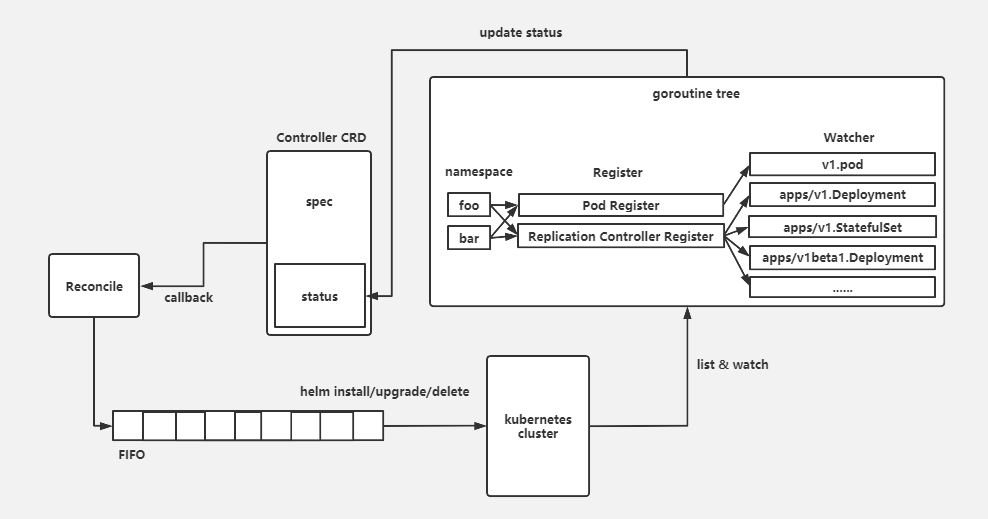

# Quick start 

### Introduction

Multi-tenancy-operator is a kubernetes operator for multi-tenancy manage. According to deploy in kubernetes cluster, setting the Custom-Resources-Definition multitenancy.dev/Controller could install the chart package into the namespace what you need. Also cloud change the chart parameters in Controller, it will take effect immediately in kubernetes cluster, such as replica numbers. In the Controller status, pods which are deployed by Controller and the statuses of replication controller , include deployment,  statefulSet, daemonSet could receive live updates.

### 介绍

multi-tenancy-operator 是一个用于多租户管理的 kubernetes operator。通过部署在 kubernetes 集群中，使用提供的 CRD 模型  multitenancy.dev/Controller ，可以将 helm 仓库中的 chart 部署在配置的命名空间中。通过改变 Controller 配置参数可以实时更新集群中部署的 chart 状态，如实例个数等。在 status 中实时更新控制器 API （ deployment 、statefulSet 、daemonSet）和已部署的 pod 的状态。

### 部署

可以通过以下命令将一个 example 部署在您的 kubernetes 集群中

```shell

```

如果需要配置自己的 helm 仓库，使用以下命令部署一个正式的 multi-tenancy-operator 在 kubernetes 集群中

``` shell

```

### 如何使用

以部署的 example 为例

一个集群内只能存在一个 multitenancy.dev/Controller，多余的 multitenancy.dev/Controller 会被删除。

如果不使用 releaseName ，将会默认把 namespace 作为 releaseName 的参数。


### 基本原理



通过改变 multitenancy.dev/Controller 的参数，调用 operator 的回调函数 Reconcile，这是 operator-sdk 的默认实现。

改变参数后，首先校验改变的参数是否合法，然后通过一个先进先出队列执行 helm install / upgrade / delete 更新 kubernetes 集群中已部署 chart 的状态。之后检查有分别在这些 namespace 下，有哪些需要注册和注销的 watcher。watcher 是一个回调函数，通过 list & watch 机制，某一个监听 namespace 下 apiVersion 的 kind 是否有变化，如果有变化，会执行这个回调函数。list & watch 机制在 kubernetes 中相当多的地方都有用到。通过 watcher 可以获取 pod 和  replication controller 状态并更新到 multitenancy.dev/Controller 的 status 中。通过 go context 管理 register 和 watcher 的生命周期。